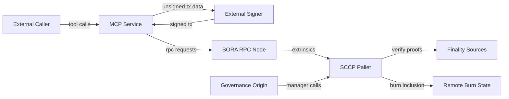

## Executive summary
SCCP’s highest-risk themes are governance-plane integrity, proof-verification execution cost, and MCP deployment hardening when exposed beyond local trust boundaries. The runtime contains strong fail-closed and replay-protection controls, and SCCP runtime weight wiring/MCP default policy hardening were remediated after this model was produced.

## Scope and assumptions
In scope:
- `pallets/sccp/src/lib.rs`
- `pallets/sccp/src/evm_proof.rs`
- `pallets/sccp/src/tron_proof.rs`
- `pallets/sccp/src/weights.rs`
- `runtime/src/lib.rs`
- `runtime/src/tests/sccp_runtime_integration.rs`
- `misc/sccp-mcp/src/*.rs`
- `misc/sccp-mcp/config.example.toml`
- `docs/security/audits/sccp-2026-02-20/ownership-map-out/*`

Out of scope:
- Sibling repos (`../sccp-eth`, `../sccp-bsc`, `../sccp-tron`, `../sccp-sol`, `../sccp-ton`) except as external trust boundaries.
- Infrastructure controls not represented in repo (firewalls, WAF, IAM policy specifics).

Assumptions:
- MCP deployment is potentially internet-exposed (user-confirmed context for this model).
- Primary business objective is preventing unauthorized mint/burn and cross-domain integrity failure.
- Governance origin (`EitherOfDiverse<AtLeastHalfCouncil, EnsureRoot<AccountId>>`) remains the privileged control plane (`runtime/src/lib.rs:2355`).
- SCCP runtime uses benchmarked SCCP weights (`runtime/src/lib.rs:2367`).

Open questions that could materially change ranking:
- Is MCP always fronted by strong authn/authz and network allowlisting in production?
- What are target throughput and worst-case block resource budgets for proof/header submission?
- What operational controls exist for governance key custody and emergency pause runbooks?

## System model
### Primary components
- SCCP pallet: burn/mint/attest, proof verification, incident controls (`pallets/sccp/src/lib.rs`).
- On-chain proof helpers: EVM RLP/MPT and TRON header utilities (`pallets/sccp/src/evm_proof.rs`, `pallets/sccp/src/tron_proof.rs`).
- Runtime configuration: governance origin, SCCP limits, SCCP weight wiring (`runtime/src/lib.rs:2326`, `runtime/src/lib.rs:2353`, `runtime/src/lib.rs:2367`).
- MCP service: stdio JSON-RPC tool dispatcher for SCCP-related operations (`misc/sccp-mcp/src/mcp.rs`, `misc/sccp-mcp/src/tools.rs`).

### Data flows and trust boundaries
- External caller -> MCP service.
  - Data: tool names, payloads, proof bytes, signed tx blobs.
  - Channel: MCP JSON-RPC frames over stdio bridge.
  - Security guarantees: request-size bound and argument validation.
  - Validation: frame parsing with `max_request_bytes` and strict JSON shape (`misc/sccp-mcp/src/mcp.rs:13`, `misc/sccp-mcp/src/mcp.rs:99`).
- MCP service -> SORA RPC endpoint.
  - Data: JSON-RPC requests and signed extrinsics.
  - Channel: HTTP JSON-RPC.
  - Security guarantees: none in code beyond transport use; depends on endpoint/network controls.
  - Validation: RPC error handling and JSON result checks (`misc/sccp-mcp/src/rpc_client.rs:7`, `misc/sccp-mcp/src/rpc_client.rs:25`).
- User/relayer -> SORA extrinsics (`burn`, `mint_from_proof`, `attest_burn`).
  - Data: burn payloads, proofs, destination info.
  - Channel: Substrate extrinsics.
  - Security guarantees: signed origin for user flows, domain validation, paused-domain checks, fail-closed verifier availability.
  - Validation: extrinsic-level `ensure!` gates and proof checks (`pallets/sccp/src/lib.rs:2001`, `pallets/sccp/src/lib.rs:2101`, `pallets/sccp/src/lib.rs:2982`).
- Governance origin -> SCCP configuration.
  - Data: finality modes, anchors, attesters, endpoints, pause/invalidation controls.
  - Channel: privileged runtime calls.
  - Security guarantees: `ManagerOrigin` gating.
  - Validation: domain support and mode compatibility checks (`runtime/src/lib.rs:2355`, `pallets/sccp/src/lib.rs:2933`).
- SCCP pallet -> remote burn state verification.
  - Data: EVM MPT proofs, TRON/BSC headers, attester signatures.
  - Channel: on-chain verification logic.
  - Security guarantees: fail-closed decoding/verification paths, replay suppression.
  - Validation: proof decode, bounded checks, finalized-mode checks (`pallets/sccp/src/lib.rs:2631`, `pallets/sccp/src/lib.rs:2845`, `pallets/sccp/src/lib.rs:2061`, `pallets/sccp/src/lib.rs:2193`).

#### Diagram

## Assets and security objectives
| Asset | Why it matters | Security objective (C/I/A) |
|---|---|---|
| SCCP-managed asset supply | Unauthorized mint/burn directly impacts funds | Integrity |
| Burn/attestation message state (`ProcessedInbound`, `AttestedOutbound`) | Prevents replay/double-claim | Integrity |
| Governance configuration (finality mode, anchors, attesters, endpoints) | Misconfiguration or takeover can alter trust assumptions | Integrity, Availability |
| SCCP runtime liveness | Verification paths are compute-heavy and consensus-facing | Availability |
| MCP tool surface and policy | Exposed control plane can be abused operationally | Integrity, Availability |
| Incident controls (pause/invalidate) | Needed for containment under attack | Integrity, Availability |
| Auditability/events | Needed to detect and respond to abuse | Integrity |

## Attacker model
### Capabilities
- Remote caller can submit malformed, high-cost, or adversarial inputs to reachable interfaces.
- Public users can submit permissionless SCCP runtime calls where allowed.
- Adversary can replay observed payloads/proofs and probe for idempotency failures.
- If MCP is internet-exposed, attacker can invoke allowed tools directly.

### Non-capabilities
- Attacker cannot bypass on-chain signature checks without key compromise.
- Attacker cannot mint via SCCP without satisfying proof/finality checks unless verifier logic is flawed.
- Attacker cannot use governance-only SCCP calls without compromising governance origin.

## Entry points and attack surfaces
| Surface | How reached | Trust boundary | Notes | Evidence (repo path / symbol) |
|---|---|---|---|---|
| `burn` | Signed user extrinsic | User -> Runtime | Generates message IDs and digest commitments | `pallets/sccp/src/lib.rs:1867` |
| `mint_from_proof` | Signed user extrinsic | User -> Runtime | Proof-heavy mint path with replay checks | `pallets/sccp/src/lib.rs:2001` |
| `attest_burn` | Signed user extrinsic | User -> Runtime | Non-SORA attest path with digest commitment | `pallets/sccp/src/lib.rs:2101` |
| `submit_bsc_header` | Signed user extrinsic | User -> Runtime | Permissionless header ingestion | `pallets/sccp/src/lib.rs:1191` |
| `submit_tron_header` | Signed user extrinsic | User -> Runtime | Permissionless header ingestion | `pallets/sccp/src/lib.rs:1509` |
| Governance config calls | Manager origin extrinsics | Governance -> Runtime | Finality/anchor/attester controls | `runtime/src/lib.rs:2355` |
| MCP `tools/call` | MCP client request | Caller -> MCP | Built-in auth token required for tool methods (`tools/list`, `tools/call`) | `misc/sccp-mcp/src/mcp.rs:68` |
| MCP submit tools | Dispatch path | MCP -> chain RPC | Submit signed extrinsic/tx/message | `misc/sccp-mcp/src/tools.rs:358` |
| Outbound RPC client | HTTP JSON-RPC | MCP -> external RPC | Dependency availability and timeout behavior | `misc/sccp-mcp/src/rpc_client.rs:7` |

## Top abuse paths
1. Governance takeover -> switch finality modes/anchors -> accept attacker-controlled burn attestations -> unauthorized mint or irreversible integrity damage.
2. Adversarial proof/header spam -> expensive decode/verify paths under sustained load -> block saturation -> SCCP and chain liveness degradation.
3. Verifier logic flaw exploitation -> craft proof passing validation for non-existent burn -> `mint_from_proof` succeeds -> fund inflation.
4. Attester key compromise/collusion -> satisfy threshold signatures -> forge inbound proof acceptance under `AttesterQuorum` mode.
5. Internet-exposed MCP with weak/stolen auth token or over-broad allowlist -> invoke submission tools -> unauthorized operational actions if signed payload supply is available.
6. MCP request flooding + expensive downstream RPC calls -> process starvation -> degraded relay/ops availability.
7. Governance misconfiguration of domain endpoints/remote token IDs -> valid burns become unmintable or routed incorrectly -> fund access disruption.
8. Replay of previously valid message IDs -> attempt duplicate mint/attest -> blocked by state checks, but remains a persistent attack attempt surface.

## Threat model table
| Threat ID | Threat source | Prerequisites | Threat action | Impact | Impacted assets | Existing controls (evidence) | Gaps | Recommended mitigations | Detection ideas | Likelihood | Impact severity | Priority |
|---|---|---|---|---|---|---|---|---|---|---|---|---|
| TM-001 | Governance key compromise | Compromise of council/root authority or signing process | Modify finality/anchor/attester config to attacker-favorable state | Unauthorized mint/burn or trust model collapse | Asset supply, config integrity | Manager gating (`runtime/src/lib.rs:2355`), mode checks (`pallets/sccp/src/lib.rs:2933`) | No in-repo evidence of multi-party governance key hardening | Multi-sig/HSM controls, strict change windows, mandatory dual-control for SCCP config extrinsics | Alert on SCCP manager-call events and config diffs per block | Medium | High | critical |
| TM-002 | Public transaction spammer | Ability to submit permissionless calls | Saturate proof/header verification paths with adversarial bounded inputs | Runtime liveness degradation | Runtime availability | Input bounds (`pallets/sccp/src/lib.rs:2856`), header size checks (`pallets/sccp/src/lib.rs:1193`, `pallets/sccp/src/lib.rs:1515`), benchmark-derived runtime weight wiring (`runtime/src/lib.rs:2367`) | Benchmark setup for some paths still relies on conservative floors and should be recalibrated with real-world fixtures over time | Keep SCCP benchmark refresh in release process; add stress benchmarks for worst-case proofs | Track per-extrinsic execution time/weight saturation and block fullness anomalies | Medium | High | medium |
| TM-003 | Sophisticated proof attacker | Ability to craft chain-specific proof payloads | Exploit verifier parsing/logic bug to pass invalid burn proof | Unauthorized mint | Asset supply integrity | Fail-closed verification (`pallets/sccp/src/lib.rs:2631`), mode availability checks (`pallets/sccp/src/lib.rs:2982`), direct malformed-input/fuzz-style tests and property-based parser robustness tests for EVM/TRON proof helpers (`pallets/sccp/src/evm_proof.rs:329`, `pallets/sccp/src/tron_proof.rs:210`), `cargo-fuzz` harnesses for EVM/TRON helper modules (`pallets/sccp/fuzz/Cargo.toml:1`), CI guards enforcing parser regression tests and fuzz harness presence (`.github/scripts/check_sccp_proof_parser_tests_guard.sh:1`, `.github/scripts/check_sccp_proof_fuzz_harness_guard.sh:1`) | Independent external review requirement is process-based and not mechanically enforced in-repo | Keep fuzz corpora growth + periodic bounded fuzz runs in CI/nightly jobs; keep independent review requirement | Alert on mint events with unusual source domains/proof size patterns | Low | High | high |
| TM-004 | Attester collusion or key theft | `AttesterQuorum` enabled and threshold keys compromised | Produce valid quorum signatures for fake message IDs | Unauthorized inbound acceptance | Asset integrity, trust model | Threshold and uniqueness checks (`pallets/sccp/src/lib.rs:2705`, `pallets/sccp/src/lib.rs:2772`) | Security depends on off-chain attester key hygiene and threshold policy | Raise threshold, rotate attesters, hardware-backed signing, monitor attester behavior drift | Alert when attester mode is enabled or attester set/threshold changes | Medium | High | high |
| TM-005 | Remote MCP caller | MCP reachable over network and token/allowlist controls are weak | Invoke submit/read/build tools for unauthorized operations | Operational abuse, possible transaction relay misuse | MCP control plane, chain ops availability | Policy gate exists (`misc/sccp-mcp/src/tools.rs:339`), default read-only allowlist + deny-by-default semantics (`misc/sccp-mcp/src/config.rs:203`), built-in tool-method auth token checks with constant-time token comparison and bounded token length policy (`[auth].min_required_token_bytes` + `[auth].max_token_bytes`) (`misc/sccp-mcp/src/config.rs:175`), bounded per-principal auth-failure backoff with tracked-principal cap (`misc/sccp-mcp/src/mcp.rs:85`), submit-tool security audit logging (`misc/sccp-mcp/src/tools.rs:415`) | Residual risk if auth token is leaked/reused broadly or gateway isolation is weak | Token rotation, least-privilege tool allowlist, external authn/authz, network ACLs | Alert on `SECURITY_AUDIT` submit-tool events and `SECURITY_AUTH_BACKOFF` auth-failure streak events (principal-scoped) | Medium | Medium | medium |
| TM-006 | Network adversary / unstable RPC dependency | Ability to cause RPC slowness/failures | Exhaust MCP worker via slow/hanging upstream RPC interactions | Service degradation and delayed operations | MCP availability | Error handling for RPC responses, explicit connect/read/write timeouts, bounded retries for retry-safe read methods, in-process circuit-breaker fail-fast behavior, bounded in-flight RPC load-shedding via `SCCP_MCP_RPC_MAX_INFLIGHT` + `SCCP_MCP_RPC_MAX_INFLIGHT_PER_ENDPOINT` + `SCCP_MCP_RPC_MAX_INFLIGHT_PER_PRINCIPAL` + `SCCP_MCP_RPC_MAX_INFLIGHT_PER_SCOPE` + `SCCP_MCP_RPC_MAX_INFLIGHT_PER_METHOD` (`SECURITY_RPC_BACKPRESSURE`), and opt-in weighted principal-aware DRR admission queueing (`SCCP_MCP_RPC_QUEUE_*`, `SCCP_MCP_RPC_PRINCIPAL_WEIGHT_*`) with queue backpressure/admit telemetry (`SECURITY_RPC_QUEUE_BACKPRESSURE`, `SECURITY_RPC_QUEUE_ADMIT`) (`misc/sccp-mcp/src/rpc_client.rs`) | Residual operational risk depends on correct principal identity propagation (`requester_id`) and conservative queue/weight tuning; shared credentials still reduce fairness granularity | Keep conservative in-flight + queue caps, require requester tagging on shared gateways, and tune principal weights from observed contention telemetry | Monitor request latency percentiles, timeout/error ratios, `SECURITY_RPC_BACKPRESSURE` scope breakdown (`global|endpoint|principal|tool|method`), and `SECURITY_RPC_QUEUE_BACKPRESSURE` reason rates (`queue_full_global|queue_full_principal|queue_timeout`) plus `SECURITY_RPC_QUEUE_ADMIT` wait-time trends | Low | Medium | low |
| TM-007 | Misconfiguration/operator error | Incorrect endpoint/remote-token settings | Activate token with inconsistent endpoint semantics across domains | Funds delayed/blackholed, failed mint completion | Availability and operational integrity | Domain/token presence and length checks (`pallets/sccp/src/lib.rs:2355`, `pallets/sccp/src/lib.rs:2369`), MCP activation preflight checker with per-domain readiness output (`misc/sccp-mcp/src/tools.rs:756`) | Runtime still cannot enforce live cross-chain semantic equivalence beyond local length/presence constraints | Keep preflight mandatory in rollout process, require dual-operator sign-off on preflight output, and add staged rollout checks per domain | Alert on repeated `RemoteTokenMissing`/`DomainEndpointMissing` errors and preflight `ready=false` outcomes | Medium | Medium | medium |
| TM-008 | Replay attacker | Access to historical payloads/proofs | Re-submit already-used burn messages for duplicate mint/attest | Duplicate-processing attempt (blocked) | Message state integrity | Replay guards (`pallets/sccp/src/lib.rs:2061`, `pallets/sccp/src/lib.rs:2193`) | None material in reviewed path | Keep guards immutable and include replay invariants in regression suites | Alert on repeated `InboundAlreadyProcessed`/`BurnAlreadyAttested` failures | High | Low | low |

## Criticality calibration
For this SCCP context:
- **critical**: immediate, plausible loss or unauthorized creation/destruction of value across domains.
  - Example: governance compromise that changes verification trust assumptions and permits false mints.
  - Example: deterministic bypass of proof verification leading to unauthorized mint.
- **high**: likely to materially impair security objectives (integrity or sustained liveness) without immediate guaranteed fund theft.
  - Example: stale or under-calibrated benchmark weights on proof-heavy extrinsics increasing block DoS risk.
  - Example: exposed MCP submission surface with permissive policy and no external auth.
  - Example: attester quorum compromise where mode is enabled for active domains.
- **medium**: meaningful exploitability but bounded impact or strong compensating controls.
  - Example: RPC dependency hangs degrading MCP availability.
  - Example: endpoint/token misconfiguration causing recoverable operational failures.
  - Example: partial abuse requiring additional prerequisites not evidenced in repo.
- **low**: low-impact or already strongly mitigated by in-code controls.
  - Example: replay attempts blocked by existing processed/attested state checks.
  - Example: malformed payload attempts rejected by strict validation.

## Focus paths for security review
| Path | Why it matters | Related Threat IDs |
|---|---|---|
| `pallets/sccp/src/lib.rs` | Core mint/burn/attest logic, mode gating, replay guards, proof verification entrypoints | TM-001, TM-002, TM-003, TM-004, TM-008 |
| `pallets/sccp/src/evm_proof.rs` | Custom RLP/MPT parser and proof traversal are integrity-critical parser surfaces | TM-003 |
| `pallets/sccp/src/tron_proof.rs` | TRON raw header parsing and signature recovery trust boundary | TM-003 |
| `pallets/sccp/src/weights.rs` | Benchmark-derived weights for costly paths (requires periodic recalibration) | TM-002 |
| `runtime/src/lib.rs` | Runtime SCCP integration and governance/weight wiring | TM-001, TM-002 |
| `runtime/src/tests/sccp_runtime_integration.rs` | Regression depth for security invariants and fail-closed behavior | TM-002, TM-003, TM-008 |
| `misc/sccp-mcp/src/mcp.rs` | MCP frame parsing and request dispatch boundary | TM-005 |
| `misc/sccp-mcp/src/tools.rs` | Tool dispatch, submit surfaces, policy enforcement, and activation preflight checks | TM-005, TM-007 |
| `misc/sccp-mcp/src/sora_calls.rs` | SCALE call construction and proof argument handling | TM-005, TM-007 |
| `misc/sccp-mcp/src/payload.rs` | Canonical payload parsing and strictness controls | TM-005, TM-008 |
| `misc/sccp-mcp/src/rpc_client.rs` | Outbound RPC resilience and failure handling | TM-006 |
| `misc/sccp-mcp/config.example.toml` | Operational default policy posture for deployments | TM-005 |

## Operational Follow-ups

- Deployment guardrails: `docs/security/sccp_mcp_deployment_guardrails.md`
- Security ownership process: `docs/security/sccp_security_ownership.md`
